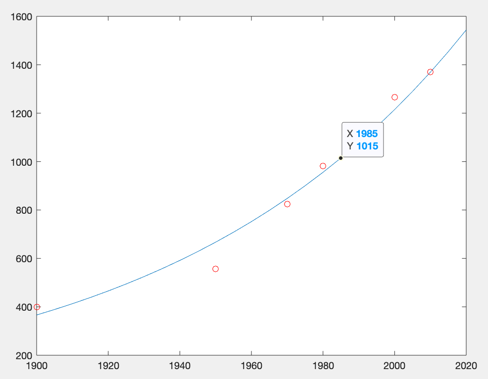

# CSU33081: Computational Mathematics

## Assignment 2 - Senán d'Art - 17329580  

### Question 1

Answer: (ii)  
$$
L = 
\begin{array}{cc}
 1.0000  &  0       &   0       &  0\\
-2.0000  &  1.0000  &   0       &  0\\
 0.5000  &  1.5000  &   1.0000  &  0\\
-2.0000  &  3.0000  &  -0.5000  &  1.0000\\
\end{array}
$$
$$
U = 
\begin{array}{cc}
4.0000  &  -1.0000  &  3.0000  &  2.0000\\
0       &  -2.0000  &  3.0000  &  0.5000\\
0       &   0       &  4.0000  &  2.0000\\
0       &   0       &  0       &  3.0000\\
\end{array}
$$

```matlab
[L, U] = LUdecompGauss([4 -1 3 2;-8 0 -3 -3.5;2 -3.5 10 3.75;-8 -4 1 -0.5])

function [L, U] = LUdecompGauss (A)
    [x, y] = size(A)
    if x <= 0 || x ~= y
        disp("Matrix Is Not Square!");
        return
    end

    L = eye(x, x);
    U = A;

    for i = 1:x
        for j = i + 1:x
            c = U(j, i) / U(i, i);
            for k = 1:x
                U(j, k) = U(j, k) - (c * U(i, k));
            end
            L(j, i) = c;
        end
    end
end
```

<br><br>

### Question 2 

Best: **2 & 5**  
Worst: **1**

<br><br>

### Question 3

Eqn: $p = be^{mx}$  
Linear (from slides): $ln(p) = mx + ln(b)$  

The following code was used:  
```matlab
[a1, a0] = LinearReg(time, log(population));
years = 1900:5:2020;
plot(years, exp(a0) * exp(a1 * years), time, population, 'ro')

function [a1, a0] = LinearReg(x,y)
    nx=length(x);
    ny=length(y);
    if nx ~= ny
        disp('ERROR: The number of elements in x must be the same as in y.');
        a1 = 'Error';
        a0 = 'Error';
    else
        Sx = sum(x);
        Sy = sum(y);
        Sxy = sum(x.*y);
        Sxx = sum(x.^2);
        a1 = (nx*Sxy-Sx*Sy)/(nx*Sxx-Sx^2);
        a0 = (Sxx*Sy-Sxy*Sx)/(nx*Sxx-Sx^2);
    end
end
```



Answer: (i)  
$b = 4.6831 * 10^{-8}$  
$m = 0.022$  
$Pop = 1014$
